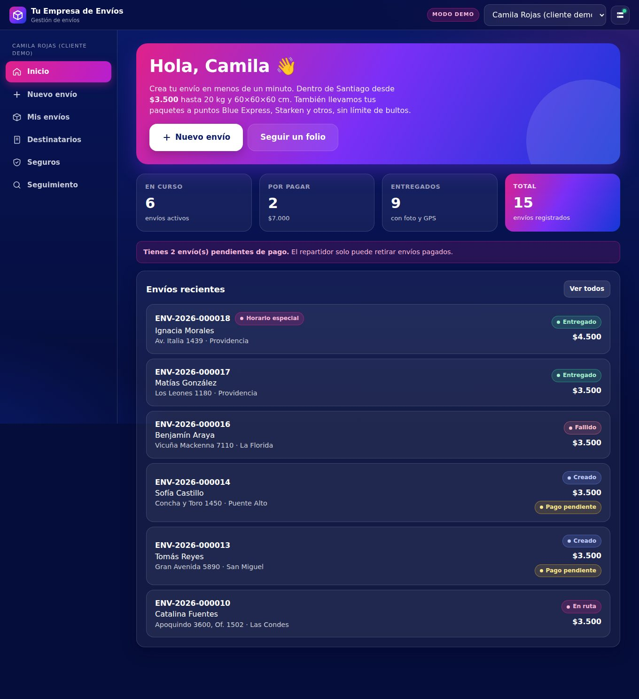

# Plataforma de Gestión de Envíos · Chile

Levantamiento, definición funcional y técnica, **prototipo navegable** y **suite QA** de una plataforma de envíos para Chile. Los clientes crean y pagan sus envíos, el administrador los asigna y controla las ganancias, y el repartidor entrega con **foto obligatoria y GPS**.

| | |
|---|---|
| Servicio | Levantamiento, análisis y definición — **$220.000 CLP** |
| Fecha meta | **26 de octubre de 2026** |
| Estado | Documentación v2.0 en validación · Prototipo v0.1 (modo demo sin inicio de sesión) |
| Despliegue | Railway (API + interfaz) · **Supabase** (PostgreSQL + Storage) · opcionalmente Vercel (interfaz) |



## 🚀 Subir la primera versión (Railway + Supabase)

Guía paso a paso: **[docs/12-primera-version-railway-supabase.md](docs/12-primera-version-railway-supabase.md)**. En resumen:

1. Crea el proyecto en Supabase y copia: URI del **Session pooler**, **Project URL** y **Secret key**.
2. `cp .env.railway.example .env` → completa → `npm run verificar:railway` (debe decir "Todo listo").
3. Railway → *Deploy from GitHub repo* → elige la rama → *Generate Domain* → pega las variables de [`.env.railway.example`](.env.railway.example) en *Raw Editor*.
4. Abre `https://tu-app.up.railway.app` e ingresa tu `DEMO_CLAVE`.

Las tablas, las 346 comunas, los perfiles demo y el bucket privado de fotos/boletas se crean solos en el primer arranque.

## Documentación (entregables)

| # | Documento |
|---|---|
| 00 | [Propuesta de servicio, cronograma y entregables](docs/00-propuesta-de-servicio.md) |
| 01 | [Documento de alcance actualizado (v2.0)](docs/01-documento-de-alcance.md) |
| 02 | [Requerimientos funcionales y no funcionales](docs/02-requerimientos.md) |
| 03 | [Flujo general del sistema y estados](docs/03-flujo-del-sistema.md) |
| 04 | [Roles y permisos](docs/04-roles-y-permisos.md) |
| 05 | [Priorización de la primera versión](docs/05-priorizacion-v1.md) |
| 06 | [Consideraciones técnicas e integraciones](docs/06-consideraciones-tecnicas.md) |
| 07 | [Restricciones y fuera de alcance](docs/07-restricciones-y-fuera-de-alcance.md) |
| 08 | [Plan de QA y criterios de aceptación](docs/08-plan-qa-y-criterios-de-aceptacion.md) |
| 09 | [Base para estimar y planificar el desarrollo](docs/09-plan-de-desarrollo.md) |
| 10 | [Despliegue: localhost, Railway, Vercel y NIC.cl](docs/10-despliegue.md) |
| 11 | [Decisiones tomadas y pendientes del cliente](docs/11-decisiones-y-pendientes.md) |
| 12 | [Subir la primera versión: Railway + Supabase](docs/12-primera-version-railway-supabase.md) |

## Reglas de negocio implementadas

- **Tres perfiles:** Administrador, Cliente y Repartidor.
- **Tarifa $3.500** dentro de Santiago hasta **20 kg y 60×60×60 cm** por bulto. Sobre eso, cotización especial (solo admin).
- **Puntos Blue Express, Starken y otros:** sin límite de paquetes por $3.500.
- **Envío especial por horario:** +$1.000, con franja obligatoria.
- **Pago previo:** sin pago el repartidor **no puede retirar** (regla de la API y de la base de datos).
- **Entrega:** "Llegué" → espera máxima de **5 minutos** → entrega con **foto obligatoria + GPS**, o intento fallido con motivo. **Máximo 3 intentos**; después se devuelve.
- **Seguro:** valor declarado por envío; para cobrarlo **la boleta es obligatoria** (archivo + N°, fecha y monto). El monto no puede superar el valor declarado ni la boleta.
- **Libreta:** cada destinatario queda registrado y puede tener **varias direcciones**.
- **Seguimiento por folio** (`ENV-2026-000123`) sin datos personales.
- **Colores:** azul 60 %, magenta 30 %, blanco 10 %. Nombre y logo configurables (por definir).

## Probar en tu computador (localhost)

Necesitas Node.js 20+ y PostgreSQL (o Docker).

```bash
docker compose up -d        # base de datos local
cp .env.example .env
npm install
npm run dev                 # http://localhost:3000
node scripts/datos-demo.js local   # opcional: carga envíos de ejemplo
```

Abre `http://localhost:3000` y elige un perfil arriba (**modo demo, sin inicio de sesión**).

## ¿Dónde pongo la URL de Railway?

En **[`entornos.env`](entornos.env)**, en la raíz:

```env
URL_LOCAL=http://localhost:3000
URL_RAILWAY=https://tu-app.up.railway.app
URL_VERCEL=https://tu-app.vercel.app
```

- Pruebas: `npm run qa:local` · `npm run qa:railway` · `npm run qa:vercel`
- Interfaz: `npm run build:web` genera `web/config.js` con la API elegida (`API_OBJETIVO`).
- En la app: el botón de **servidor** (arriba a la derecha) cambia entre localhost y Railway sin recompilar.

Guía completa: [docs/10-despliegue.md](docs/10-despliegue.md).

## Pruebas

```bash
npm test            # 21 pruebas unitarias (reglas de negocio, conexión Supabase, Storage)
npm run verificar   # revisa variables, conexión a la base y almacenamiento antes de desplegar
npm run qa:local    # 52 casos QA extremo a extremo (CP-01 … CP-66) contra localhost
```

Cada caso QA está trazado a un requerimiento en el [plan de QA](docs/08-plan-qa-y-criterios-de-aceptacion.md). Los reportes JUnit quedan en `qa/reportes/`.

## Estructura

```
docs/            Entregables (alcance, requerimientos, flujo, roles, QA, plan) y capturas
server/          API Node.js + Express + PostgreSQL
  db/            Migraciones SQL, 346 comunas, carga inicial
  lib/           Reglas de negocio, ticket PDF + QR, archivos, EXIF
  routes/        Endpoints: envíos, pagos, seguros, reportes, catálogos, público
web/             Interfaz PWA (HTML/CSS/JS sin compilación)
qa/              Suite QA configurable por entorno
tests/unit/      Pruebas unitarias
scripts/         Generador de config web y datos de ejemplo
entornos.env     URLs de localhost / Railway / Vercel / producción
.env.railway.example  Variables para pegar en Railway (Supabase)
railway.json     Configuración de Railway
vercel.json      Configuración de Vercel
```

## Importante antes de producción

El modo demo (`AUTH_MODE=demo`) **no pide inicio de sesión**: sirve solo para revisar el visual. Con datos reales se usa `AUTH_MODE=jwt`, se integra la pasarela de pago real y se registra el dominio `.cl`. Ver la lista de verificación en [docs/10-despliegue.md](docs/10-despliegue.md#5-lista-de-verificación-antes-de-producción).
