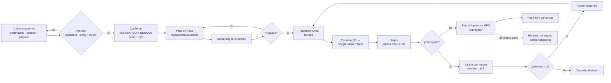
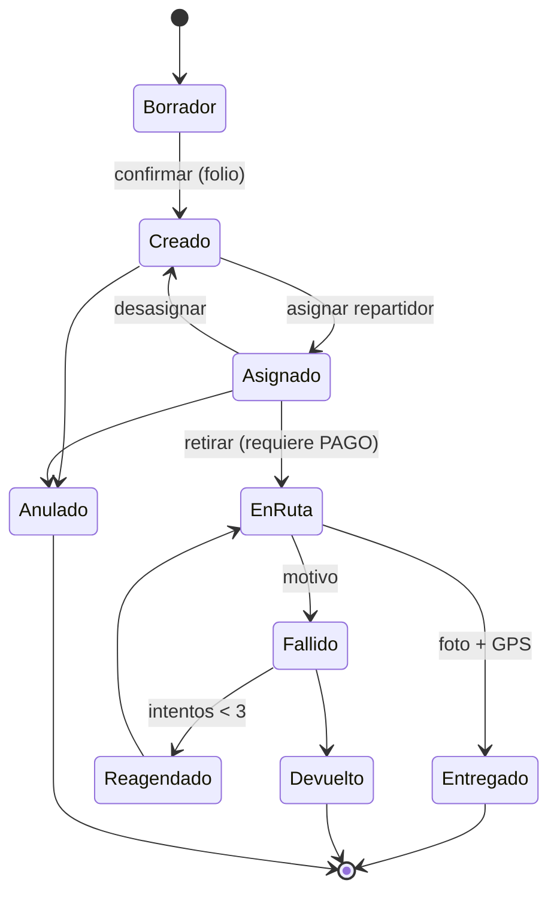
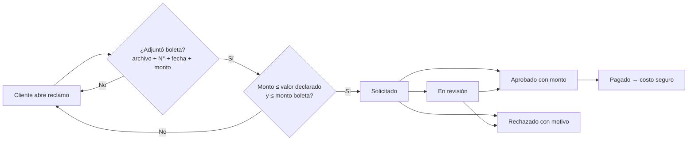

# 03 · Flujo general del sistema

## 1. Flujo de extremo a extremo

## 2. Paso a paso

| # | Actor | Paso | Reglas |
|---|---|---|---|
| 1 | Cliente | Elige destinatario de su libreta o crea uno nuevo | Teléfono `+56 9 XXXX XXXX`; queda guardado en la libreta |
| 2 | Cliente | Elige destino: domicilio o punto courier (Blue, Starken, Chilexpress, Correos, otra) | Comuna en cobertura; si el destinatario se cambió de casa, agrega una dirección nueva |
| 3 | Cliente | Describe el paquete: producto, bultos, peso, medidas, valor declarado, boleta (opcional aquí), horario especial | ≤ 20 kg y ≤ 60 cm por lado por bulto; horario especial exige franja (+$1.000) |
| 4 | Cliente | Revisa el resumen y la tarifa, confirma | Se asigna folio; se genera ticket 80 mm/A4 y QR |
| 5 | Cliente | Paga en línea | Sin pago no hay retiro |
| 6 | Admin | Asigna repartidor | Solo envíos creados/asignados |
| 7 | Repartidor | Retira ("Retirar y salir a ruta") | Bloqueado si no está pagado |
| 8 | Repartidor | Escanea el QR o toca "Ir con Maps/Waze" | La página del QR no muestra teléfono ni nombre |
| 9 | Repartidor | "Llegué al destino" | Inicia la espera de 5 minutos |
| 10a | Repartidor | Entregar: toma foto y se captura el GPS | Foto obligatoria; GPS obligatorio (configurable) |
| 10b | Repartidor | No se pudo entregar: elige motivo | "Espera excedida" solo tras 5 min; suma 1 intento |
| 11 | Admin | Reagenda (si intentos < 3) o devuelve | Al 3.er intento solo "devolver" |
| 12 | Todos | Consultan el estado del folio | Público: solo estado e historial |
| 13 | Cliente → Admin | Reclamo de seguro con boleta | Ver §4 |

## 3. Estados del envío

| Estado | Significa | Quién lo cambia |
|---|---|---|
| Borrador | En carga, sin folio | Cliente / Admin |
| Creado | Confirmado, con folio y ticket | Cliente / Admin |
| Asignado | Tiene repartidor | Admin |
| En ruta | Retirado (pagado) y en camino | Repartidor asignado / Admin |
| Entregado | Con foto, GPS y hora (final; cuenta para ganancias) | Repartidor asignado / Admin |
| Fallido | Intento no logrado, con motivo | Repartidor asignado / Admin |
| Reagendado | Se reintenta | Admin |
| Devuelto | Volvió al origen (final) | Admin |
| Anulado | Cancelado, no se borra (final) | Admin; cliente solo si no está pagado ni asignado |

**Estado de pago** (independiente): Pendiente → Pagado (→ Reembolsado, a definir).

## 4. Flujo del seguro (boleta obligatoria)

Condiciones: el envío debe tener valor declarado > 0, no estar en borrador ni anulado, y no tener otro reclamo activo. La boleta se guarda como archivo privado; solo se abre con enlace firmado temporal.

## 5. Flujo de pago

1. El cliente pulsa **Pagar** → el servidor crea un registro de pago (`iniciado`) con token único.
2. Se redirige a la pasarela (en el prototipo: pasarela simulada con tarjeta de prueba).
3. La pasarela confirma (webhook / URL de retorno) → pago `aprobado` → envío `pagado`.
4. Un pago no se procesa dos veces; un envío pagado no se vuelve a cobrar.
5. Alternativa: el administrador registra pago manual (transferencia/efectivo) con referencia.
