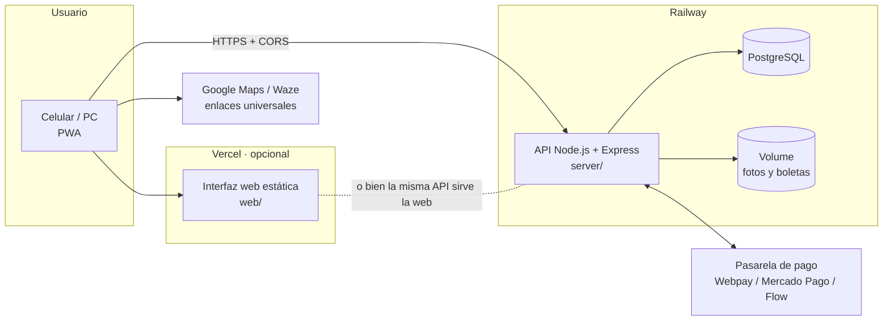

# 06 · Consideraciones técnicas e integraciones

## 1. Arquitectura

**Dos formas de publicar** (se elige en [10-despliegue.md](10-despliegue.md)):
1. **Solo Railway** (recomendado para partir): la API sirve también la interfaz. Un dominio, sin CORS.
2. **Railway + Vercel**: Railway para la API y la base; Vercel para la interfaz. La interfaz conoce la URL de Railway por `web/config.js`, que se genera desde `entornos.env` o con la variable `API_URL` en Vercel.

## 2. Tecnología

| Capa | Elección | Motivo |
|---|---|---|
| Interfaz | HTML + CSS + JavaScript (módulos ES), PWA, sin compilación | Carga rápida en 4G, se publica igual en Railway o Vercel, fácil de mantener |
| API | Node.js ≥ 20, Express 4 | Estándar, amplio soporte en Railway |
| Base de datos | PostgreSQL (Railway) | Datos relacionales, reportes, restricciones que protegen las reglas |
| Archivos | Disco en Volume de Railway → migrar a S3/R2 en producción | Fotos y boletas privadas con enlaces firmados de 10 min |
| PDF | PDFKit en el servidor | Ticket idéntico en cualquier dispositivo |
| QR | `qrcode`, corrección de errores H | Escanea bien en térmica |
| Autenticación | JWT 30 días + bcrypt; modo demo sin login para el prototipo | Seguridad probada, sin inventar |
| Pruebas | `node:test` (unitarias + QA contra cualquier entorno) | Sin dependencias extra |

## 3. Reglas protegidas en la base de datos

Además de validarse en la API, estas reglas están como restricciones de PostgreSQL, por lo que ningún error de programación futuro puede saltárselas:

- `envio_pagado_para_retirar`: un envío no puede estar *en ruta* ni *entregado* sin estar pagado.
- `reclamo_seguro.boleta_adjunto_id NOT NULL`: no existe reclamo sin boleta.
- `reclamo_monto_tope` y `reclamo_aprobado_tope`: lo reclamado no supera la boleta y lo aprobado no supera lo reclamado.
- Folios con `UNIQUE` y correlativo atómico por año (`folio_contador`).

## 4. Modelo de datos

| Tabla | Contenido principal |
|---|---|
| `usuario` | nombre, correo, contraseña (hash), rol (admin/cliente/repartidor), teléfono, RUT, activo |
| `zona` / `comuna` | 346 comunas con región y provincia, cobertura, zona y tarifa propia |
| `destinatario` | libreta del cliente: nombre, teléfono, correo, RUT |
| `direccion` | varias por destinatario: calle, número, depto, referencia, comuna, principal, activa |
| `envio` | folio, token QR, cliente, destinatario, dirección, tipo de destino (domicilio/punto courier), empresa y punto courier, producto, bultos, peso, medidas, valor declarado, horario especial y franja, desglose de tarifa, estado, estado de pago, repartidor, intentos, llegada, GPS de entrega, receptor |
| `envio_estado` | historial: estado anterior/nuevo, motivo, usuario, fecha, lat/lon |
| `adjunto` | fotos de paquete y de entrega, boletas (ruta privada, tipo, hash SHA-256) |
| `pago` | proveedor, monto, estado, token, referencia |
| `reclamo_seguro` | N° SEG-AAAA-NNNNNN, motivo, montos, boleta (archivo, N°, fecha, monto, RUT emisor), estado, resolución |
| `costo` | bencina, comisión, peaje, mantención, **seguro**, otro |
| `config` | negocio, tarifas, operación, ticket, pagos |
| `auditoria` | quién hizo qué, cuándo y desde qué IP |

## 5. Folios, QR y mapas

- **Folio de envío:** `ENV-2026-000123` (correlativo por año, nunca se repite). **Reclamo:** `SEG-2026-000001`.
- **QR:** apunta a `https://<dominio>/q/<token>` (token aleatorio de 144 bits, no adivinable). La página muestra la dirección, la comuna en grande y los botones **Ir con Google Maps** / **Ir con Waze**; **no muestra nombre ni teléfono**. Cada escaneo queda en auditoría. El administrador puede cambiarlo para abrir Google Maps o Waze directamente.
- **Enlaces:** Google Maps `https://www.google.com/maps/dir/?api=1&destination=…&travelmode=driving`; Waze `https://waze.com/ul?q=…&navigate=yes` (o `ll=lat,lon` si hay coordenadas). Gratis, sin API key.
- **Precisión de direcciones:** siempre se envía calle + número + comuna + región + Chile. Para eliminar ambigüedades, en desarrollo se puede sumar Google Places (pagado; decisión P-06).

## 6. Criterios para el ticket

- 80 mm térmico y A4, generados en el servidor como PDF.
- Contiene: nombre del negocio, leyenda "comprobante interno — no es documento tributario", folio grande, fecha, QR ≥ 2,5 cm con margen blanco, destinatario, dirección con **comuna en mayúsculas grandes**, punto courier si corresponde, producto y medidas, valor declarado, horario especial destacado, tarifa y estado de pago, texto de pie configurable.
- Debe probarse en la impresora real del cliente (criterio de aceptación CA-06).

## 7. Integraciones y servicios externos

| Servicio | Uso | Estado | Costo / requisito |
|---|---|---|---|
| Pasarela de pago (Webpay Plus de Transbank, Mercado Pago o Flow) | Pago en línea previo al retiro | Interfaz lista con proveedor **simulado**; integrar el real en desarrollo | Cuenta de comercio **a nombre del cliente**; comisión por transacción |
| Google Maps / Waze (enlaces) | Navegación | ✅ | Gratis |
| Google Places (opcional) | Autocompletar y validar direcciones | No incluido | Pago por uso, requiere tarjeta en Google Cloud |
| Blue Express / Starken / Chilexpress | Entrega en sus puntos | Registro manual de empresa, punto y código | Integración con sus API: fuera de v1 |
| NIC.cl | Dominio `.cl` | Pendiente del nombre | ≈ 1 UF al año aprox. (verificar tarifa vigente); a nombre del cliente |
| Railway | API, PostgreSQL, volumen de archivos | Configurado (`railway.json`) | Plan según uso |
| Vercel | Interfaz (opcional) | Configurado (`vercel.json`) | Plan Hobby/Pro |
| Correo transaccional (Resend, SendGrid, etc.) | Recuperar contraseña, avisos | No incluido | Pendiente |
| Almacenamiento S3/R2 | Fotos y boletas en producción | Interfaz preparada | Pago por GB |

## 8. Seguridad y privacidad

Contraseñas con bcrypt · HTTPS obligatorio · cabeceras de seguridad (Helmet, CSP) · CORS restringido a los dominios declarados · fotos y boletas privadas con enlaces firmados que expiran · EXIF/GPS eliminado de las fotos (en el navegador y en el servidor) · el repartidor no ve montos ni boletas · límite de intentos de inicio de sesión · auditoría. Datos personales regulados por la Ley 19.628 y la Ley 21.719: revisar con un abogado antes de salir a producción.

## 9. Configuración por entorno

| Archivo | Para qué |
|---|---|
| `entornos.env` | **URLs de localhost, Railway, Vercel y producción** (lo usan las pruebas QA y la interfaz) |
| `entornos.local.env` | Credenciales locales para QA en modo con login (no se sube al repositorio) |
| `.env` (copiar de `.env.example`) | Variables del servidor: base de datos, secretos, CORS, modo de autenticación |
| `web/config.js` | Generado por `npm run build:web`: a qué API se conecta la interfaz |
